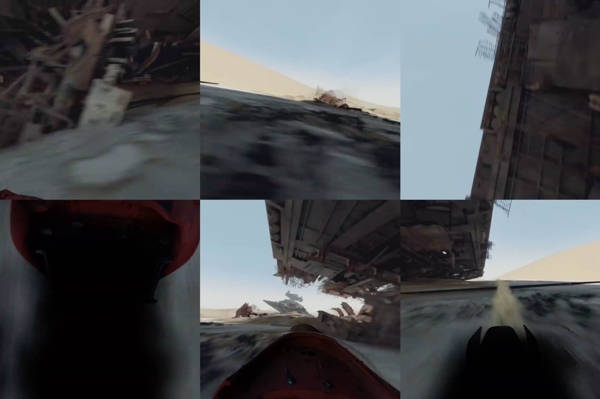

# 360 Video
:warning: THIS IS A HIGHLY EXPERIMENTAL PLUGIN :warning:

[Demo](https://thiago.me/clappr-360)

360 Video is a plugin for playing 360 videos with Clappr, just like in Facebook.

It was tested on Chrome, Firefox and Safari only.

### Building:

```
$ npm install
$ npm run build
```

### Using:
With the scripts in your page do:
```javascript
var p = new Clappr.Player({
    source: 'starwars.mp4#360',
    plugins: {
        playback: [Playback360]
    },
    parentId: '#player',
});
// for a better 360 experience, disable clappr's click_to_pause plugin
p.getPlugin('click_to_pause').disable();
```

Use the `#360` hash to tell the plugin that your `.mp4` is 360 compatible.
A 360 compatible mp4 file looks like this:

